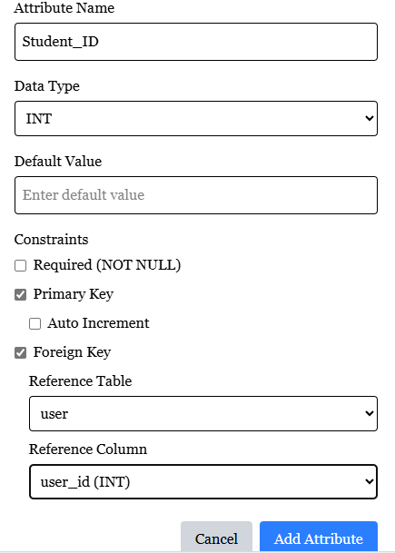
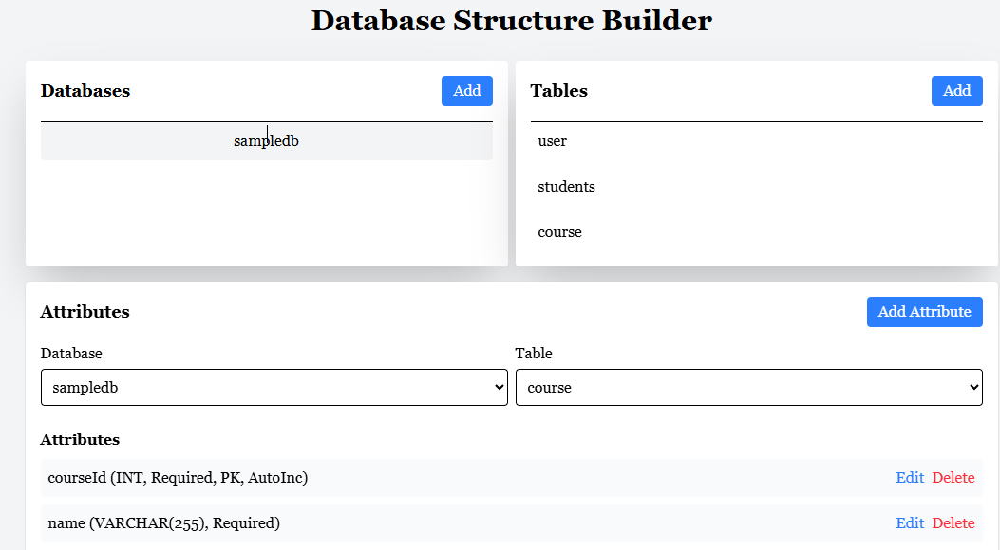

# Repository Description (For GitHub/GitLab/Bitbucket)

## Title: Database Schema Builder & SQL Generator

Short Description:
A Next.js web app that visually designs database schemas (tables, columns, relationships) and auto-generates SQL scripts for deployment. Supports SQL Server, PostgreSQL, and MySQL(default for SQL Server).

# Database Schema Builder

A Next.js application for visually designing database schemas and generating SQL deployment scripts.




## Features

- **Visual Table Designer**: Create tables with columns, primary keys, and constraints.
- **Foreign Key Relationships**: Define relationships between tables.
- **SQL Script Generation**: Auto-generates SQL for:
  - SQL Server
  - PostgreSQL
  - MySQL

## 🛠️ Tech Stack

- **Frontend**: Next.js (React), TypeScript, Tailwind CSS
- **Backend**: Next.js API Routes
- **Database**: SQL Server (default, configurable)
- **Validation**: Zod

## 🚀 Getting Started

### Prerequisites

- Node.js v18+
- SQL Server (or Docker for local testing)

### Installation

1. Clone the repo:
   ```bash
   git clone https://github.com/meleayi/database-design-building-using-UI.git
     ```
   Install dependencies:
 
2. install dependancy
     ``` git install 
      ```

**Copy**

  ```
export const dbConfig = {
server: "your-server-name",
user: "your-username",
password: "your-password",
port:1433// change based on you SQL Server Configration
database: "master", // Default connection database
options: { encrypt: true, trustServerCertificate: true }
};
  ```
**Run the app:**

  ```
npm run dev

  ```

Let me know if you'd like to emphasize any specific feature (e.g., PostgreSQL support) or add a
